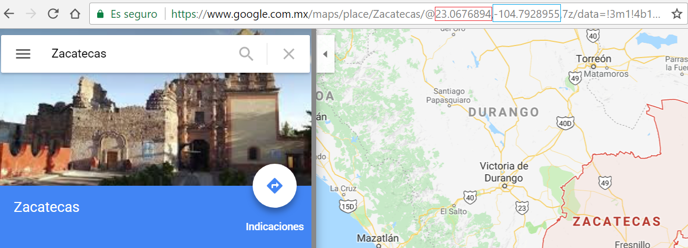

## Ejercicio Workshop

- Haz un fork de este repositorio bajo tu usuario
- Crea un branch y nombralo con tus iniciales
- Ve a google maps y busca la ciudad en la que naciste
- Toma la latitud y longitud de la ciudad de la siguiente manera (latitud rojo, longitud azul)
  
- Modifica el archivo positions.js agregando un objecto JSON al array con la siguiente 
estructura:  
````javascript
{"lt":25.548597,"lg":-103.4719557}
````
- Sube tu cambio a tu repositorio
- Crea un pull request de tu repositorio a este repositorio (de tu branch a master)
- Espera a que tu PR sea aprovado
- Ve al siguiente [link](https://cmedinilla.github.io/github-workshop-map/)
